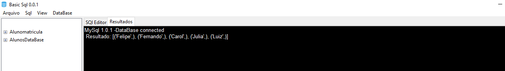

# SQlBasics open beta 0.0.1

# O que é o Sql Basics

  

O Sql Basics é uma ferramenta de esxecução de querys SQL na qual o usuario não precisa instalar o MySql ou ter processos complicados de conexão com o banco de dadps, com poucos cliques você já esta conectado com o banco de dados seja ele remoto ou local.
pré requisitos para utilizar o sistema: 
<ul>
  <li>Ter o python instalado em sua maquina</li>
  <li>Conexão com a internet</li>
  <li>Conhecimento com Sql </li>
</ul>
 
Para executar o programa rode o aqruivo <b>SqlBasic 0.01.ink</b>

## Como utilizar a ferramenta

Primeiramente você precisa criar uma conexão antes de tudo para que você consiga executar as querys e conseguir ver o seu banco de dados.
para iniciar segue a tela inicial  
 

 

Após o preenchimento, automaticamente ira aparecer no lado esquerdo todas as tabelas que o seu banco de dados possui, e pode ampliar cada elemento para poder acessar suas colunas de forma individual.
Caso você tenha algum problema e não consiga realizar a conexão recomendamos que refaça o primeiro processo de criação de conta, para isso você precisa apagar a conta existente e abrir novamente e programa.

## Execução de uma Query
Para executar uma query antes digite o comando de query dentro de SqlEditor e aós isso vá na aba Sql > Executar , desta maneira ele ira executar a query em questão e aparecera na tela de resultados.

Dentro da tela de resultados que é na aba ao lado de SqlEditor você verifica o retorno que sua query obteve:

Na tela de resultado mostra em formato de Trupla, onde cada valor ente parenteses é um registro da sua tabela, nessa versão ainda não é possivel mostrar o nome da coluna na qual pertece dentro do seu SELECT.

## Problemas de permissão

Caso você rode a sua query e apareça esse resultado na tela de resultados: 

Isso significa que você não tem privilegios o suficiente para realizar essa query, nesse caso utilize a função "enviar query para aprovacao" , para que o admnistrador consiga rodar a sua query  bloqueada.

